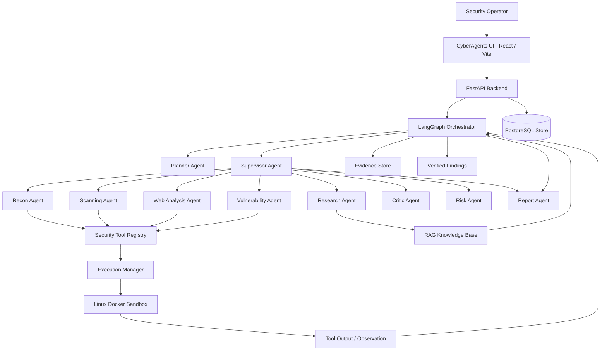

# CyberAgents — Agentic AI Cybersecurity Copilot

[](LICENSE)
[](https://www.python.org/)
[](https://www.typescriptlang.org/)
[](https://fastapi.tiangolo.com/)
[](https://reactjs.org/)
[](https://www.docker.com/)

**CyberAgents** is an autonomous **Agentic AI Cybersecurity Copilot** designed to orchestrate specialized AI agents for authorized security assessments, threat discovery, network reconnaissance, containerized vulnerability scanning, evidence validation, and structured executive reporting.

---

## Overview

### The Problem
Traditional cybersecurity assessments rely on fragmented command-line tools, manual output parsing, static scripts, or rigid dashboard forms. Security teams face high overhead in correlating raw scanner output, filtering false positives, verifying authorization scopes, and compiling actionable executive reports.

### The CyberAgents Solution
CyberAgents replaces static scanners and complex dashboards with a **ChatGPT-like conversational workspace** powered by **LangGraph multi-agent orchestration**. Security operators state their assessment intent in natural language (e.g., *"Scan my authorized web application for exposure"*), and CyberAgents automatically:
1. Identifies targets and requests explicit user authorization confirmation.
2. Formulates structured multi-stage execution plans.
3. Coordinates specialized AI security agents (Recon, Scanning, Vulnerability, Critic, Risk, Report).
4. Executes security tools (Nmap, DNS, HTTP banner inspectors) inside isolated **Linux Docker worker containers**.
5. Validates raw output rigor to eliminate false positives.
6. Generates structured findings, evidence artifacts, and executive security reports.

### Authorized Security Assessment Scope
CyberAgents is explicitly built for **authorized cybersecurity assessment use cases**, such as enterprise security operations centers (SOCs), penetration testing engagements, red team automation, and authorized lab environments. All active tool execution is strictly gated by target scope validation and explicit user confirmation.

---

## Key Features

- **ChatGPT-Like Assessment Workspace**: Natural language interaction for initiating security assessments, asking follow-up questions, and triggering active tool runs.
- **LangGraph Multi-Agent Orchestration**: State-driven workflow engine coordinating 9 specialized security agents with state persistence.
- **9 Specialized Security Agents**: Planner, Supervisor, Recon, Scanning, Web Analysis, Vulnerability Research, RAG Research, Critic Validation, and Executive Reporting agents.
- **Real Linux Docker Sandbox**: Security tools run inside dedicated worker containers (`cyberagents/security-worker`) pre-installed with Nmap, DNS utilities, HTTP inspectors, and parsers.
- **Dynamic Target Authorization**: Target scope validation ensures tools run only against user-confirmed assessment targets.
- **Real-Time Streaming Execution Trace**: SSE event stream delivers live visibility into agent reasoning, plan step updates, tool executions, and discovered evidence.
- **Critic False-Positive Validation**: Automated evidence validation requiring a 90%+ confidence score before registering confirmed findings.
- **RAG Threat Intelligence Knowledge Base**: Vector-backed retrieval (Qdrant) over MITRE ATT&CK techniques, OWASP Top 10, and CWE advisories.
- **Interactive PTY Workspace Terminal & File Browser**: Full interactive terminal session and shared filesystem browser for inspecting sandbox execution artifacts.
- **PostgreSQL & Store Persistence**: Full state persistence for assessments, findings, execution logs, and reports.

---

## Architecture



For complete agent specifications, contract schemas, and state definitions, see [docs/AGENTS.md](docs/AGENTS.md).

---

## Quickstart & Setup Guide

### Prerequisites
- **Docker Desktop** (with Linux container support enabled)
- **Python 3.11+**
- **Node.js 18+** & **npm**

---

### Option A: Docker Compose (Recommended)

To launch the complete stack (FastAPI Backend, React Frontend, Linux Docker Sandbox, PostgreSQL, Redis, Qdrant):

```bash
# 1. Clone repository
git clone https://github.com/xkaper001/cyberagents.git
cd cyberagents

# 2. Copy environment file
cp .env.example .env

# 3. Build and start services
docker compose up --build
```

Access services at:
- **Frontend Workspace**: `http://localhost:5173` (or `http://localhost:3000`)
- **FastAPI Documentation**: `http://localhost:8000/docs`

---

### Option B: Local Development Setup

#### 1. Backend Setup
```bash
# Create virtual environment
python -m venv venv
# On Windows:
venv\Scripts\activate
# On Linux/macOS:
source venv/bin/activate

# Install Python dependencies
pip install -r requirements.txt

# Run FastAPI backend server
uvicorn backend.main:app --reload --host 0.0.0.0 --port 8000
```

#### 2. Frontend Setup
```bash
# Install Node dependencies
npm install

# Start Vite development server
npm run dev
```

#### 3. Sandbox Image Build
```bash
# Build the Linux worker image for local tool execution
docker build -t cyberagents/security-worker:latest ./security-worker
```

---

## API Reference Summary

| Method | Endpoint | Description |
|---|---|---|
| `POST` | `/api/chat` | Main SSE streaming endpoint for conversational queries and agent execution stream. |
| `POST` | `/api/assessments/{id}/authorization` | Confirms user target authorization and registers active assessment scope. |
| `GET` | `/api/assessments` | Lists all active and completed security assessments. |
| `POST` | `/api/assessments` | Creates a new security assessment instance. |
| `GET` | `/api/findings` | Retrieves verified findings filtered by severity or asset. |
| `GET` | `/api/workspace/files` | Browses files in the isolated Linux worker sandbox. |
| `POST` | `/api/workspace/execute` | Executes commands inside the interactive PTY terminal sandbox. |

---

## Testing & Verification

Run the full backend integration test suite (30+ tests passing):

```bash
python -m pytest backend/tests/ -v
```

Run frontend typecheck and build validation:

```bash
npm run build
```

---

## Repository Structure

```text
cyberagents/
├── backend/                  # FastAPI backend application
│   ├── agents/               # AI agent implementations (Supervisor, Planner, Recon, Scanning)
│   ├── api/routes/           # API endpoints (chat, resources, workspace)
│   ├── config/               # Settings & logging configuration
│   ├── database/             # PostgreSQL database connection & ORM models
│   ├── execution/            # Docker sandbox worker manager & execution policy
│   ├── graph/                # LangGraph state graph, nodes, & workflow
│   ├── llm/                  # LLM provider factory & prompt templates
│   ├── rag/                  # Vector search retriever & threat intel
│   ├── schemas/              # Pydantic data schemas
│   ├── security/             # Target scope validator & audit logging
│   ├── services/             # Backend store & mock state
│   ├── tests/                # Pytest integration test suite
│   ├── tools/                # Security tool registry & execution handlers
│   ├── utils/                # Target URL/IP normalizer
│   └── workspace/            # Shared workspace file manager
├── docs/                     # Authoritative documentation
│   └── AGENTS.md             # Detailed 9-agent specification & contracts
├── security-worker/          # Linux Docker Sandbox worker definition
│   ├── config/profiles.json  # Approved tool profiles
│   ├── parsers/              # Nmap, DNS, and HTTP output parsers
│   ├── Dockerfile            # Debian Linux image with security tools preinstalled
│   └── entrypoint.py         # Sandbox job execution entrypoint
├── src/                      # React/Vite TypeScript frontend
│   ├── api/                  # API client modules
│   ├── components/           # UI components (chat, timeline, views, workspace)
│   ├── context/              # React context state provider (CyberContext)
│   ├── services/             # Event reducer & SSE stream reader
│   └── types/                # TypeScript interfaces
├── docker-compose.yml        # Multi-container orchestration specification
├── Dockerfile                # Backend production Dockerfile
├── package.json              # Frontend package manifest
├── requirements.txt          # Python dependency specifications
└── README.md                 # Project README
```

---

## License

This project is licensed under the MIT License — see the [LICENSE](LICENSE) file for details.
