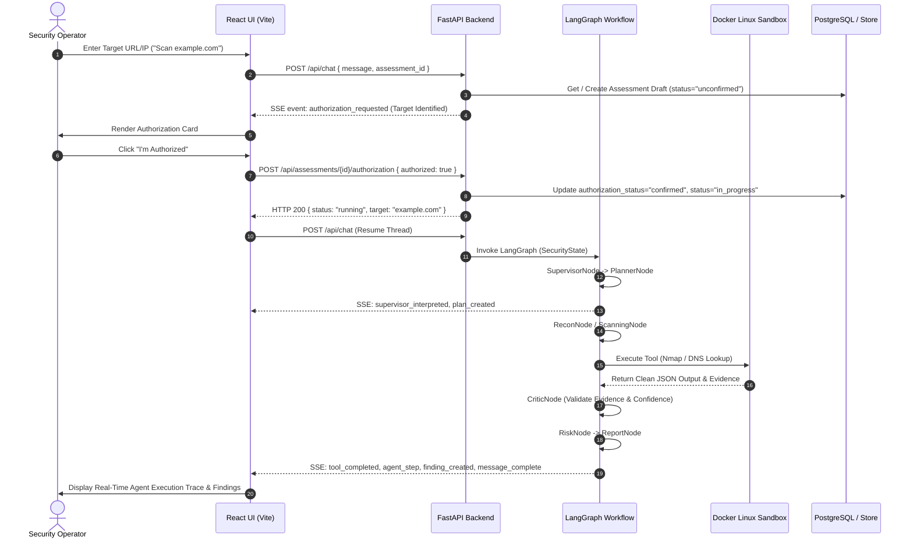

# CyberAgents — Agent Architecture & Contracts

`docs/AGENTS.md` is the authoritative specification of the multi-agent system, LangGraph state graph, agent contracts, tool bindings, and sandbox execution flow in **CyberAgents**.

---

## 1. System Overview

CyberAgents employs a **LangGraph-driven multi-agent orchestration architecture** where a central **Supervisor Agent** coordinates specialized domain agents to plan, execute, analyze, and report on cybersecurity assessments against user-authorized target environments.

### Core Architectural Principles
1. **Specialized Expertise**: Each agent operates within a dedicated domain (Planner, Reconnaissance, Scanning, Web Analysis, Vulnerability Research, RAG Research, Critic Validation, Risk Assessment, Executive Reporting).
2. **Explicit Human Authorization**: Security tool execution is strictly gated by dynamic user authorization recorded per target assessment.
3. **Containerized Execution Sandbox**: Security tools (Nmap, DNS lookups, HTTP header inspections) execute inside an isolated Linux Docker worker container (`cyberagents/security-worker`), returning clean structured JSON to the graph.
4. **Evidence Rigor**: Discovered vulnerabilities must pass verification by the **Critic Agent** before being added to confirmed assessment findings.

---

## 2. The 9 Specialized Security Agents

### 1. Supervisor Agent (`backend/agents/supervisor.py`)
- **Role**: Workflow Orchestrator & Safety Controller
- **Responsibilities**:
  - Classifies user assessment requests and validates target scope parameters.
  - Controls graph routing and delegates tasks to specialized sub-agents.
  - Maintains `SecurityState` integrity across long-running execution threads.
  - Enforces scope policies via `TargetScopeValidator`.

### 2. Planner Agent (`backend/agents/planner.py`)
- **Role**: Execution Strategy & Constraint Engine
- **Responsibilities**:
  - Deconstructs complex assessment goals into structured multi-step execution plans.
  - Assigns target agents, safety limits, and expected outputs to each plan step.
  - Updates plan status (`pending` → `running` → `completed` / `failed`) in real time.

### 3. Reconnaissance Agent (`backend/agents/recon.py`)
- **Role**: Passive Network & DNS Metadata Inspector
- **Responsibilities**:
  - Performs DNS resolution (`A`, `AAAA`, `MX`, `TXT`, `PTR` records).
  - Inspects HTTP/HTTPS response headers, server banners, and TLS/SSL configurations.
  - Identifies target infrastructure without invasive port scanning.

### 4. Scanning Agent (`backend/agents/scanning.py`)
- **Role**: Authorized Port Service Discovery & Classifier
- **Responsibilities**:
  - Executes containerized Nmap scans inside the Linux Docker worker sandbox.
  - Discovers open TCP/UDP ports, running service names, versions, and OS fingerprints.
  - Emits real-time SSE events (`tool_queued`, `tool_started`, `tool_completed`).

### 5. Web Analysis Agent (`backend/tools/recon_tools.py` / `web` profile)
- **Role**: Application Technology Stack & Header Analyzer
- **Responsibilities**:
  - Inspects web application frameworks (Apache, Spring Boot, Nginx, PostgreSQL, OpenSSL).
  - Checks missing security headers (HSTS, CSP, X-Frame-Options, X-Content-Type-Options).
  - Enumerate exposed management endpoints (e.g., `/actuator`, `/health`).

### 6. Vulnerability Agent (`backend/agents/schemas.py` / Vuln Engine)
- **Role**: CVE Database & Advisory Correlator
- **Responsibilities**:
  - Maps discovered service versions (e.g., `Apache httpd 2.4.49`) against CVE records (e.g., `CVE-2021-41773`).
  - Evaluates exploitability factors, attack paths, and path traversal vectors.
  - Generates candidate finding entries with evidence artifacts.

### 7. Research Agent (`backend/rag/retriever.py`)
- **Role**: Threat Intelligence & Knowledge Base RAG Engine
- **Responsibilities**:
  - Queries vector store (Qdrant) and local knowledge base for MITRE ATT&CK techniques (e.g., T1059.004), OWASP Top 10, and CWE definitions.
  - Injects contextual vulnerability documentation into agent context.

### 8. Critic Agent (`backend/graph/nodes.py`)
- **Role**: Evidence Rigor & False Positive Validator
- **Responsibilities**:
  - Audits candidate findings against raw tool execution stdout/stderr and raw evidence artifacts.
  - Assigns confidence scores (default threshold: 90%+ required for active findings).
  - Flags potential false positives or unverified claims for re-testing.

### 9. Risk & Report Agents (`backend/graph/nodes.py`)
- **Role**: CVSS Risk Calculator & Executive Report Generator
- **Responsibilities**:
  - Calculates composite risk scores (0.0 to 10.0 scale) based on asset criticality and vulnerability severity.
  - Compiles structured Markdown reports with executive summaries, attack surface breakdown, and prioritized remediation roadmaps.

---

## 3. LangGraph State Schema (`SecurityState`)

The state shared across all graph nodes is defined in `backend/graph/state.py`:

```python
class SecurityState(TypedDict):
    conversation_id: str
    assessment_id: str
    user_request: str
    target: str
    authorization: str               # "unconfirmed" | "confirmed" | "AUTHORIZED_LAB" | "BLOCKED_SCOPE"
    scope: Optional[str]             # Authorized CIDR or hostname
    status: str                      # "pending" | "running" | "completed" | "failed"
    current_plan: Optional[Dict[str, Any]]
    current_agent: str
    messages: List[Dict[str, Any]]
    tool_results: List[Dict[str, Any]]
    evidence: List[Dict[str, Any]]
    retrieved_documents: List[Dict[str, Any]]
    findings: List[Dict[str, Any]]
    risk_score: float
    approvals: List[Dict[str, Any]]
    errors: List[str]
    final_response: str
    report: Optional[Dict[str, Any]]
    execution_history: List[Dict[str, Any]]
```

---

## 4. Execution Workflow Sequence



---

## 5. Tool Bindings & Sandbox Integration

Security tools are executed via `backend/tools/registry.py` and routed through `backend/execution/worker_manager.py`:

| Tool Name | Binary | Allowed Profiles | Execution Sandbox | Output Format |
|---|---|---|---|---|
| `dns_lookup` | Python `socket` / `dig` | `dns_lookup`, `mx_records` | Sandbox Worker Container | Structured JSON (`ip`, `records`) |
| `http_header_analysis` | Python `urllib` / `curl` | `header_inspection`, `banner_grab` | Sandbox Worker Container | Structured JSON (`server_banner`, `headers`) |
| `nmap` | `/usr/bin/nmap` | `service_detection`, `port_scan`, `quick_scan` | Sandbox Worker Container (`cyberagents/security-worker`) | Structured JSON (`open_ports`, `services`) |

---

## 6. Verification & Safety Controls

1. **Target Authorization**:
   - Every active security tool invocation validates target against `asm_record.authorization_status == "confirmed"`.
   - Attempts to execute against unconfirmed targets trigger `BLOCKED_SCOPE` rejection.
2. **Container Isolation**:
   - Worker containers run with non-root privileges (`worker` user, `UID 1000`).
   - Read-only root filesystems with isolated `/tmp` workspace mounts.
3. **Structured Audit Logs**:
   - All authorization events print `[AUTH]` logs.
   - All LangGraph thread transitions print `[GRAPH]` logs.
   - All container invocations print `[TOOL]` execution logs.
